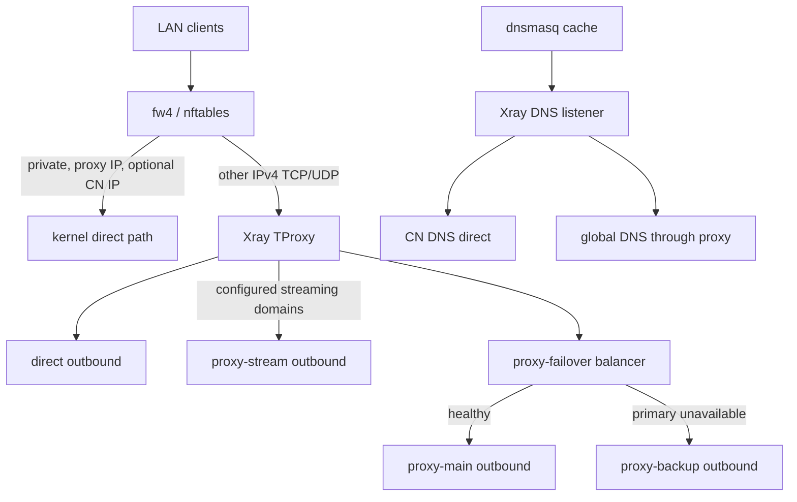

# Architecture

This project deliberately separates packet capture from policy.

## Runtime responsibilities

| Layer | Responsibility | Deliberately excluded |
| --- | --- | --- |
| dnsmasq | DHCP, local host names, `/etc/hosts`, downstream DNS cache | GeoSite/GeoIP policy and proxy selection |
| fw4/nftables | Capture selected LAN IPv4 TCP/UDP; bypass reserved, proxy-server, and optional CN IPv4 ranges | Domain policy and node selection |
| Linux policy routing | Send mark `0x1` to local table `100`, where the Xray transparent socket receives it | Geographic decisions |
| Xray | DNS selection, sniffed-domain routing, direct/proxy decisions, remote protocol | DHCP and LAN host database |

## Packet path

The generated chain is a base chain in `table inet fw4` at mangle priority. It
only handles packets entering through `LAN_INTERFACES`. Router-originated
traffic is intentionally outside the transparent path, preventing Xray's own
connections from looping back into Xray.

Known CN IPv4 destinations can return from nftables before TProxy. This is the
performance optimization: those flows retain the normal kernel forwarding/NAT
path. Disable it with `ENABLE_CN_FASTPATH=0` when domain-level force-proxy
overrides are more important than the fast path.

Unknown or foreign destinations enter Xray at `127.0.0.1:12345`. Sniffing uses
HTTP Host, TLS SNI, or QUIC metadata for domain rules while `routeOnly=true`
retains the client's original destination address.

Applications can instead use the LAN-bound `socks-in` listener on port 10808
or `http-in` on port 10809. These enter Xray directly and use its ordered
routing rules and proxy assignments, bypassing the kernel CN fast path.
SOCKS supports TCP and UDP; HTTP supports ordinary HTTP requests and HTTPS
CONNECT. Bind the listeners to the router's LAN address; SOCKS `settings.ip`
must advertise that same address for UDP relay. Streaming enablement includes
both explicit proxy listeners alongside `tproxy-in`.

## DNS path

dnsmasq listens on the normal LAN/router port 53 and forwards cache misses to
Xray at `127.0.0.1:1053`.

For A/AAAA requests, the `dns-out` outbound hijacks the request into Xray's
built-in DNS module:

- `geosite:cn` uses `223.5.5.5` through the direct outbound.
- `geosite:geolocation-!cn` uses Cloudflare DoH through `proxy-failover`.
- unmatched names use the global DoH server through `proxy-failover`.

Other query types are forwarded to `1.1.1.1:53` through the same balancer. This
avoids silently discarding non-address DNS records, while the routing-critical
A/AAAA responses still use Xray's split DNS and cache.

`DNS-GLOBAL-PROXY` matches `dns-global`, `dns-global-default`, and `dns-forward`
before private/direct/domain rules. The DNS outbound's `dialerProxy` must name
an outbound, so it points to `dns-failover`: a loopback outbound that re-enters
routing with inbound tag `dns-forward`. This bypasses the DNS hijack rules and
reaches the balancer without a new socket listener. The non-address rule's
`action: "direct"` means forward the DNS packet; its actual network path still
goes through this proxy selection, never an automatic direct Internet fallback.

Traditional TCP/UDP port-53 queries that a client sends to an external resolver
are also caught by the TProxy inbound and routed to `dns-out`. Encrypted browser
DoH is ordinary HTTPS traffic and cannot be treated as a plaintext DNS packet.

## Primary and backup selection

Xray's observatory checks HTTP reachability through `proxy-main`. The
`proxy-failover` balancer selects that single candidate with `leastPing` when
healthy, and otherwise uses its `fallbackTag`, `proxy-backup`. Keeping only the
primary in the selector preserves primary preference regardless of backup
latency. Probing continues during an outage, allowing automatic recovery.

The force-proxy and default client traffic rules, global DoH, and non-address
DNS forwarding share the balancer. CN DNS goes direct. DNS caches continue to
serve existing answers according to the configured cache policy.

Selection applies to new connections/sessions after health results change.
Before the first successful primary probe, the backup is selected. Failed
connections are not replayed, and existing sessions are not migrated. If the
backup is also unavailable (or remains the shipped blackhole), proxied traffic
fails closed. Direct/CN traffic retains its existing routing policy.
This also applies to reused DoH connections and DNS forwarding sessions:
queries may need a retry during an outage, and a healthy backup DoH connection
can remain in use after primary recovery until it reconnects.

## Dedicated streaming selection

The optional `STREAMING-PROXY` rule sends matching `tproxy-in` traffic to
`proxy-stream`. It follows DNS/private/force-direct handling and precedes
force-proxy/CN/default rules. Its shipped `.invalid` domain leaves it inactive
for real services until the administrator installs the streaming preset and
configures the outbound. It is not a member of the primary/backup balancer or
observatory selector, and has no automatic fallback.

`STREAMING2-PROXY` follows the first streaming rule and targets `proxy-stream2`.
It has its own node, domain list, and enable switch, and starts disabled. Both
rules also cover configured SOCKS/HTTP client listeners when enabled in LuCI.
The first matching rule wins, so overlapping services use `proxy-stream` when
both routes are enabled. A failure of one streaming node does not change the
other path; neither streaming node falls back to the primary/backup balancer.

GeoSite matching covers identifiable service/CDN domains, not every connection
made by an application. CN kernel bypass still happens before Xray; disable
the fast path when streaming rules must take priority over CN addresses.
DNS keeps the policy above and may require a separate change when the stream
exit region differs from the selected primary/backup. See [Streaming setup](STREAMING.md).

## Stop and failure behavior

`xrayctl stop` first restores the saved dnsmasq baseline, then removes the
TProxy service and policy routing. This gives a clean direct-network rollback.

The persistent fw4 include is a symlink to `/tmp/xray-router/30-xray-router.nft`.
The target is created only while the service is active. Because `/tmp` is
cleared at boot, an unclean shutdown cannot make fw4 load stale interception
rules before Xray and its policy route are ready.

If the Xray process crashes, procd respawns it. During that short interval the
TProxy rule remains active, so intercepted traffic fails closed rather than
leaking directly. Use `xrayctl stop` for an intentional fail-open rollback.
